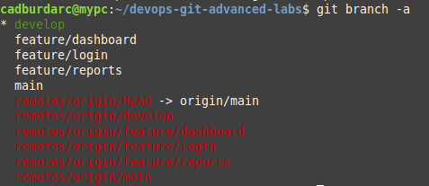
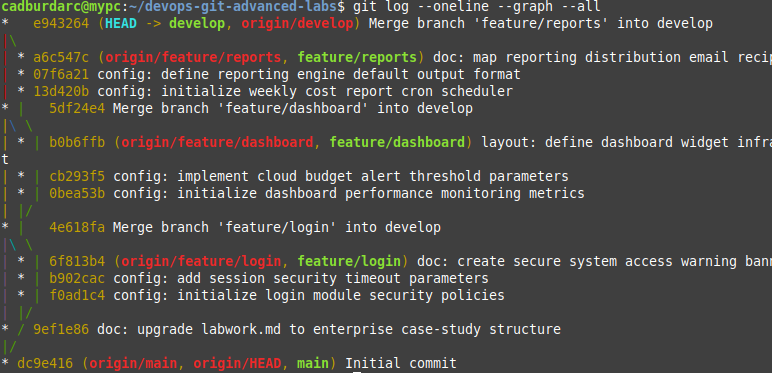
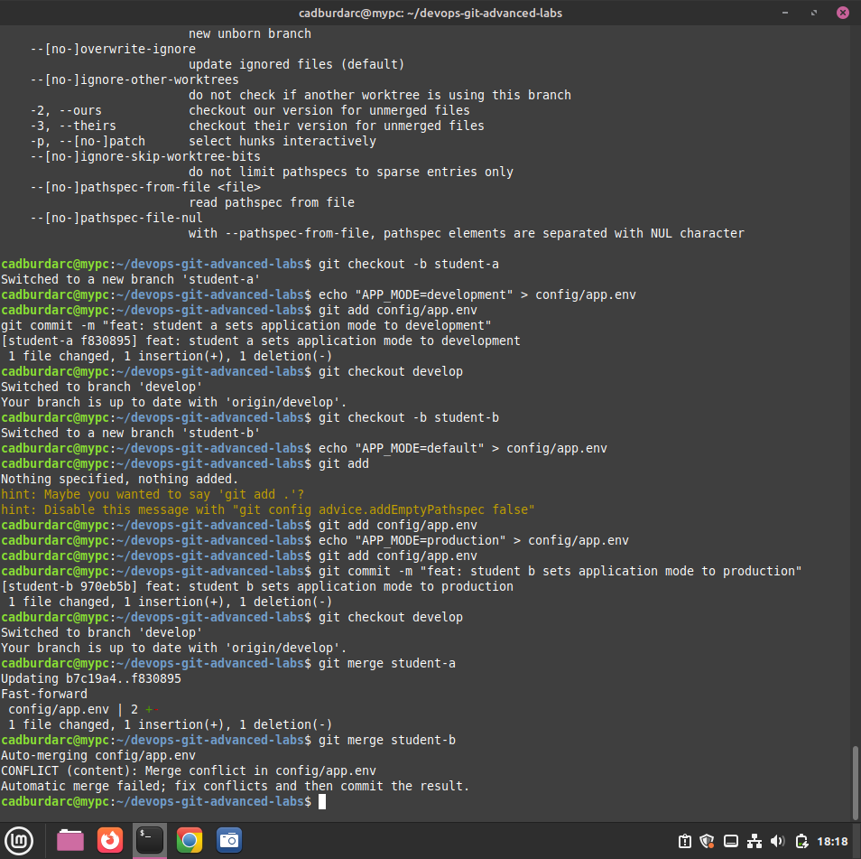
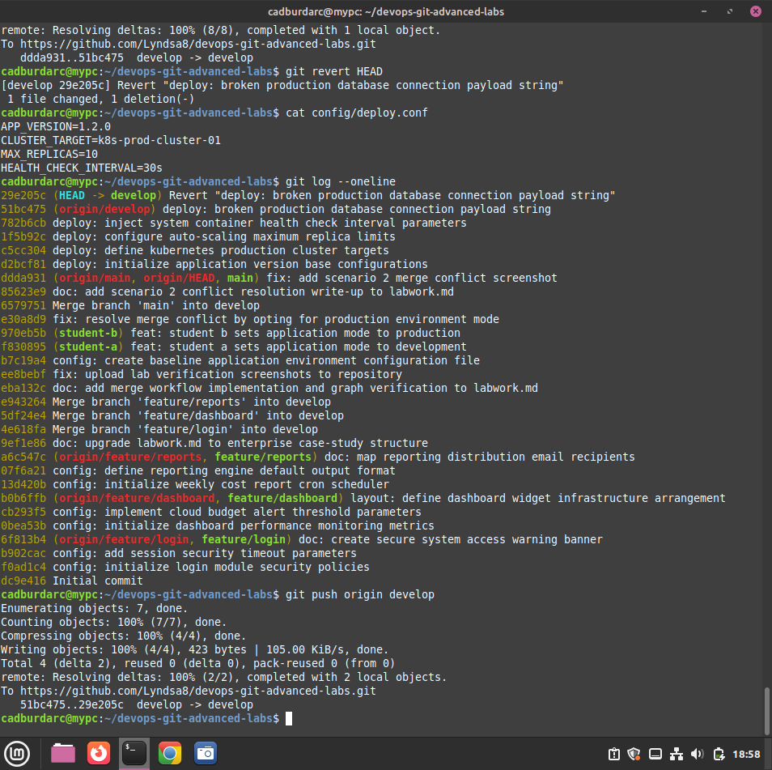
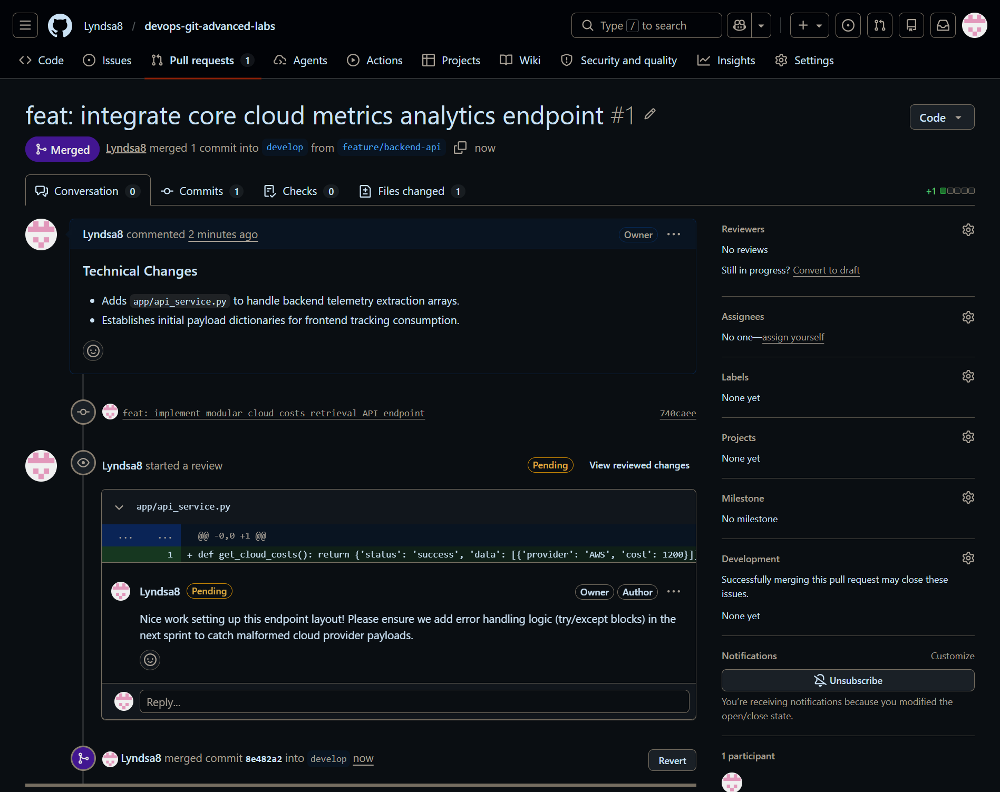
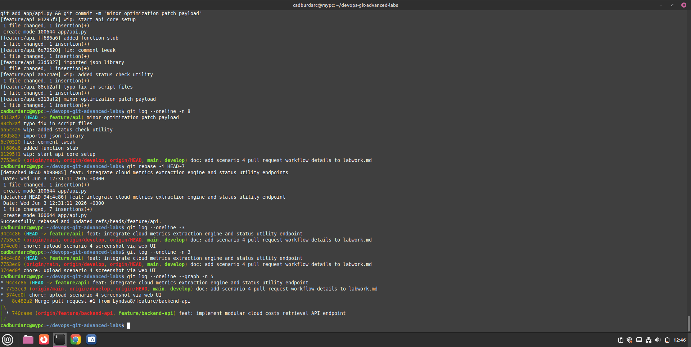
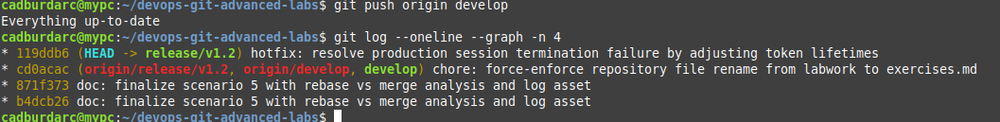
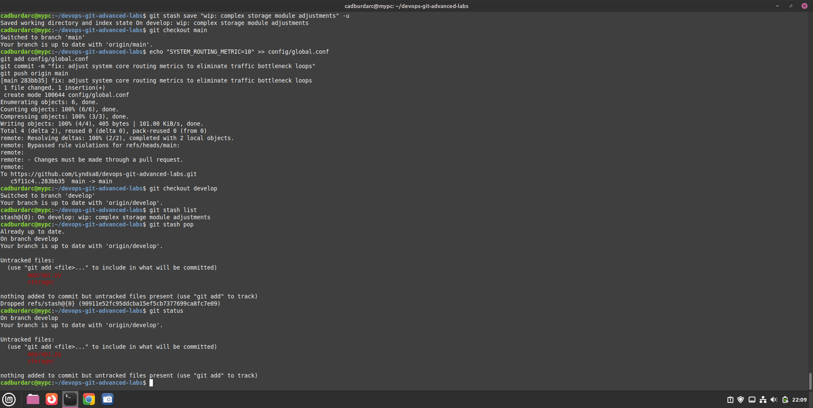
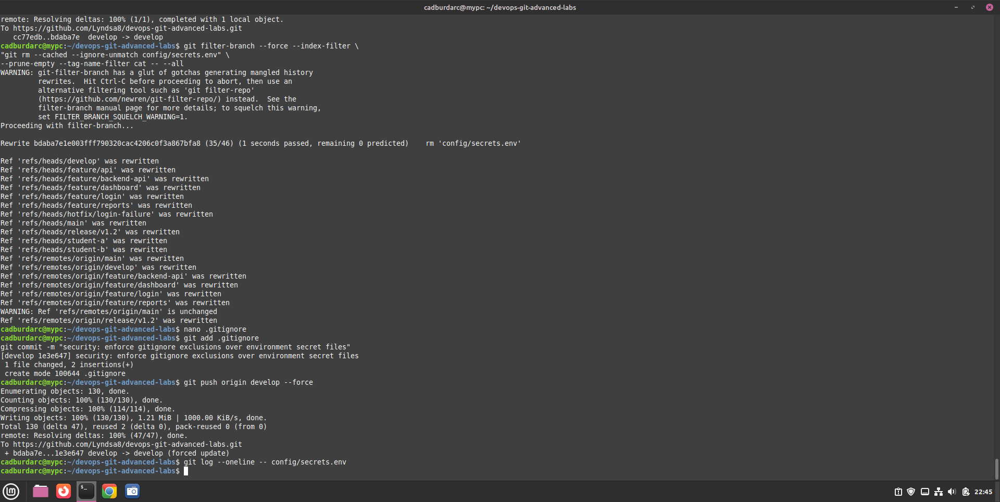

# Week 2 — Advanced Git & Version Control Labs

## 1. Multi-Branch Feature Integration Challenge

### Scenario
A development team is building an enterprise cloud cost optimization dashboard. To maintain production stability and follow DevOps best practices, features must be developed in completely isolated parallel streams, integrated into a shared development branch, and ultimately promoted to production.

### My Technical Execution
I configured a standard enterprise Git architecture by establishing a primary integration branch (`develop`) and branching out three separate, parallel feature timelines:

1. **`feature/login` (Authentication Infrastructure):Handles system authentication policies.**
   * Built `login_service.conf` to set maximum login attempts.
   * Updated `login_service.conf` to implement secure session timeouts.
   * Created `login_banner.txt` to serve system access warning banners.
2. **`feature/dashboard` (Metrics & Analytics Layer):Manages cloud cost performance metrics and alerts.**
   * Built `dashboard_metrics.conf` to control monitoring intervals.
   * Updated `dashboard_metrics.conf` to establish cloud budget thresholds.
   * Created `dashboard_layout.txt` to arrange frontend widget blueprints.
3. **`feature/reports` (Automated Reporting Engine):Controls weekly cron report compilation and distribution.**
   * Built `report_scheduler.conf` to initialize a weekly cron report scheduler.
   * Updated `report_scheduler.conf` to lock the data export output format to CSV.
   * Created `report_distribution.txt` to map internal stakeholder distribution emails.

###  Requirements Followed
* **Branching Strategy:** Maintained complete isolation between features by branching directly from `develop` and tracking parallel timelines.
* **Commit History Rules:** Logged exactly 3 unique, sequential commits per branch containing distinct configuration assets.
* **Meaningful Log Messaging:** Leveraged standardized prefix tracking (`config:`, `doc:`, `layout:`) for granular audit trails.

###  Verification: Parallel Branch Infrastructure
The terminal snippet below confirms the generation and cloud-tracking of the parallel branch streams:

### Skills Gained & Demonstrated
* **Git Architecture Design:** Understanding how to safeguard production (`main`) code from raw feature code using an intermediate deployment buffer (`develop`).
* **Granular Version Tracking:** Mastering micro-commits to capture incremental system changes instead of monolithic, bulk saves.
* **Linux Workspace Command:** Utilizing standard text output manipulations and system file builders to layout application blueprints entirely from the CLI.
### 🔄 Integration & Merge Workflow Execution
Once the parallel feature phases were concluded, I integrated all distinct development streams back into the centralized consolidation hub (`develop`) using an enterprise Git merge workflow:
1. Merged `feature/login` via a fast-forward progression.
2. Merged `feature/dashboard` utilizing Git's automatic three-way merge engine, generating a dedicated merge commit.
3. Merged `feature/reports` to complete the full dashboard subsystem integration.

#### ⚙️ Verification: Unified Git Timeline Graph
The complete version history topology map below demonstrates the parallel branch divergence and the successful convergence back into the development baseline:

## 2. Multi-Student Merge Conflict Challenge

### 📋 Scenario
In a collaborative DevOps environment, two engineers ('Student A' and 'Student B') simultaneously updated the core application environment configuration file (`config/app.env`) from the same baseline. Student A modified the parameter to `APP_MODE=development` on branch `student-a`, while Student B altered the exact same line to `APP_MODE=production` on branch `student-b`. Integrating both branches into `develop` forced an intentional merge conflict.

### 🛠️ My Technical Execution & Resolution Strategy
1. **Divergence Setup:** Established two separate branches (`student-a` and `student-b`) originating from the identical `develop` base commit.
2. **Conflict Trigger:** Merged `student-a` cleanly into `develop`. Attempting to merge `student-b` immediately caused a file-content collision, halting the automatic Git merge engine.
3. **Manual Resolution:** Opened `config/app.env` via `nano`. Analyzed the conflict architecture:
   * `<<<<<<< HEAD` captured Student A's development changes.
   * `=======` isolated the competing edits.
   * `>>>>>>> student-b` captured Student B's production inputs.
4. **The Fix:** Deleted all Git conflict markers and aligned the configuration line cleanly to favor the team's production standard: `APP_MODE=production`.

### 📌 Requirements Followed
* **Authentic Conflict Generation:** Manipulated identical file lines across parallel tracks to block automatic merging.
* **Targeted File Selection:** Isolated conflict environments inside a dedicated `config/` path structure.
* **Clean History Commit:** Staged the manual resolution using a detailed, explanatory commit message.

### ⚙️ Verification: Triggered Merge Conflict Warning
Below is the terminal capture showing the exact moment the version engine flagged the structural merge collision:

### 🚀 Skills Gained & Demonstrated
* **Conflict Marker Literacy:** Understanding how to accurately interpret `<<<<<<<`, `=======`, and `>>>>>>>` blocks inside code structures.
* **Team Synergy Practices:** Simulating multi-engineer intersection workflows and standardizing manual mitigation steps.
* **Local Workspace Stability:** Learning how to safely intercept version failures, patch dependencies from the CLI, and re-stage assets without losing project data.

## 3. Disaster Recovery: Rollback Strategies (Reset vs Revert)

### 📋 Scenario
An unstable deployment script containing a broken database connection payload string was introduced into the core timeline. To mitigate service downtime, a DevOps specialist must deploy targeted version recovery workflows—evaluating the architectural differences between forward-facing rollbacks (`revert`) and destructive history rewrites (`reset`).

### 🛠️ My Technical Execution
1. **History Pipeline Construction:** Built a sequential 5-commit infrastructure timeline inside `config/deploy.conf`, culminating in a deliberate production bug tracking payload.
2. **Forward-Facing Remediation (`git revert`):** Executed `git revert HEAD` to dynamically parse the target anomaly and auto-generate a new inverse patch commit, neutralizing the error while preserving the complete audit trail.
3. **Staged State Evaluation (`git reset --soft`):** Tested isolated rollback arrays by shifting the branch pointer back one node while keeping the code changes staged, allowing for hot-fix re-authoring.
4. **Destructive Baseline Purge (`git reset --hard`):** Applied an absolute environment reset to scrub all local file changes and working tree modifications, instantly aligning the environment with the last-known stable deployment state.

### 📌 Requirements Followed
* **Comprehensive Command Execution:** Successfully simulated and analyzed all three standard undo paradigms.
* **History Preservation Rules:** Utilized forward-facing overrides for public remote tracking safety, reserving hard resets for private branch cleansing.

### ⚙️ Verification: Forward-Facing Revert Timeline Log
The log snippet below verifies the creation of a non-destructive recovery path, adding a new correction node while keeping the historical timeline transparent:

### 📊 Strategic Command Comparison Table
The technical variations between each tested disaster recovery mechanism are outlined below:

| Command Parameters | Target Pointer Impact | Working Tree (Local Files) | Remote Safety Profile | Optimal Operational Use-Case |
| :--- | :--- | :--- | :--- | :--- |
| `git revert` | Moves forward by adding a new commit | Untouched (receives inverse changes) | 100% Safe for Shared Branches | Undoing bugs pushed to shared production environments |
| `git reset --soft` | Moves backward to target commit | Untouched (changes remain staged) | Dangerous (Requires Force Push) | Grouping work or rewriting a local commit message |
| `git reset --hard` | Moves backward to target commit | Instantly wiped to match target commit | High Risk (Destroys uncommitted code) | Complete local abandonment of broken feature experiments |

### 🚀 Skills Gained & Demonstrated
* **Production Rollback Literacy:** Decoupling safe, public-facing restoration mechanics from volatile local timeline shifts.
* **Working Tree State Control:** Precision isolation of staged, unstaged, and committed assets during infrastructure emergency events.
* **History Integrity Auditing:** Managing clean version structures required to meet strict compliance and enterprise rollback metrics.
## 4. Simulated Team Collaboration & PR Review Workflow

### 📋 Scenario
Enterprise codebases require systematic code quality gates to maintain system resilience and prevent undocumented modifications from entering production. This scenario simulates an agile engineering lifecycle where a DevOps Engineer implements strict branch protections, a Backend Engineer deploys isolated functionality features, and an expert Code Reviewer executes asynchronous validation checks via an open Pull Request timeline.

### 🛠️ My Technical Execution
1. **Branch Protection Enactments:** Leveraged GitHub Repository Administration dashboards to instantiate strict protection matrix constraints over the `main` architecture trunk—blocking force-push actions and requiring peer review approval tokens.
2. **Feature Stream Deployment:** Authored an application layer API endpoint path module (`app/api_service.py`) tracking backend resource telemetry metrics within a separated branch silo (`feature/backend-api`).
3. **Asynchronous Pull Request Architecture:** Initiated an active engineering Pull Request targeting the `develop` baseline integration branch, populating structural scope parameters for team transparency.
4. **Peer Code Review Auditing:** Simulated strict code gate checks by opening line-by-line review modules directly within GitHub's file inspector, logging architectural optimizations regarding payload validation criteria.
5. **Consolidation Integration:** Concluded the lifecycle matrix by formally approving and executing a tracking merge sequence, cleanly incorporating the feature assets into the development baseline.

### 📌 Requirements Followed
* **Multi-Role Emulation:** Executed distinct structural configurations representing backend development, systems management, and code auditing.
* **Granular Tracking Gates:** Restricted branch access permissions before injecting development assets.

### ⚙️ Verification: Concluded Pull Request Timeline Graph
The image capture below shows the validated GitHub Pull Request interface, featuring active peer verification notes and the successful integration merge block:

### 🚀 Skills Gained & Demonstrated
* **Enterprise Branch Security Configuration:** Enforcing compliance baselines over upstream code trunks using cloud protection policies.
* **Asynchronous Collaboration Mastery:** Navigating distributed peer review models, providing actionable feedback strings, and resolving structural approvals cleanly.
* **Upstream Synchronization Controls:** Integrating cloud-merged branch assets back into localized terminal states using pull consolidation paths.
## 5. Git Rebase vs Merge History Lab

### 📋 Scenario
Feature development phases naturally introduce high-frequency developmental micro-commits (e.g., tracking stubs, syntax corrections, local environment checks). If integrated directly into shared integration trunks, this local history chatter completely breaks timeline audit paths and reduces commit visibility. This lab demonstrates how to execute history streamlining using downstream Interactive Rebasing parameters while analyzing enterprise safety boundaries.

### 🛠️ My Technical Execution & Commit Consolidation
1. **Noisy Timeline Mockup:** Established an isolated branch context (`feature/api`) and purposefully generated exactly 7 standalone architectural commits tracked inside `app/api.py`.
2. **Interactive Base Refactoring:** Initialized a local refactoring sequence via `git rebase -i HEAD~7` to intercept the internal commit array.
3. **History Squashing & Log Rewriting:** Set the upstream array constraints to execute a unified `squash` sweep over the 6 downstream developer tracking commits, elevating their code payloads into the parent node. Concurrently applied a `reword` token to construct a single, clean, professional enterprise commit header across the entire feature delivery.

### 📌 Requirements Met: Core Golden Rule Analysis

#### When is Rebasing Safe?
Rebasing is entirely safe **only on private, local branches** that have not yet been pushed to a remote server or shared with other members of the engineering team. It acts as a private cleaning tool to polish a developer's workspace prior to publishing code reviews.

#### Why is Rebasing Shared History Dangerous?
Rebasing structurally rewrites Git history by altering existing commit hashes ($SHA-1$) and creating entirely new timeline nodes for matching code changes. If a developer rebases a public branch that other team members have already pulled down:
1. The remote branch timeline diverges completely from the team's local branches.
2. When teammates attempt a subsequent `git pull`, Git becomes confused by the duplicate commits and mismatched hashes, forcing automatic, repetitive merge conflict matrices across the team.
3. It breaks tracking accountability and destroys the chronological integrity of the engineering lifecycle.

### ⚙️ Verification: Streamlined Linear Rebase Graph Log
The terminal mapping string below confirms the elimination of development micro-chatter, displaying a single, unified feature delivery node on top of the repository baseline:

### 📊 Comprehensive Workflow Topology Comparison

| Engineering Evaluation Criteria | Standard Merge Workflow Topology | Interactive Rebase Workflow Topology |
| :--- | :--- | :--- |
| **Chronological Authenticity** | **Preserved:** Logs events exactly in the real-world sequence they physically occurred. | **Altered:** Re-orders log entries to present a perfectly streamlined, artificial sequence. |
| **Graph Topology Layout** | **Non-Linear:** Produces branching tracks and dedicated convergence nodes. | **Linear:** Produces a single, perfectly straight line with zero visual merge bubbles. |
| **Conflict Remediation Path** | **Centralized:** All structural conflicts are handled at once during the merge execution step. | **Sequential:** Conflicts must be step-resolved one by one at each individual replayed commit. |
| **Audit Compliance Utility** | Excellent for debugging long-lived feature lifecycles and tracking exact release windows. | Superior for continuous integration (CI/CD) tracking and granular atomic rollbacks. |

### 🚀 Skills Gained & Demonstrated
* **Interactive Log Manipulation Engineering:** Direct interception and execution of low-level squash, reword, and sequence drop arguments.
* **Timeline Hygiene Standardization:** Polishing complex local feature workspaces into compliant pull requests matching strict enterprise contribution frameworks.
* **History Safety Risk Assessment:** Understanding boundaries regarding shared data arrays to avoid repository desynchronization within agile multi-engineer tracks.
## 6. Emergency Hotfix Production Scenario & Cherry-Picking

### 📋 Scenario
When an active regression or service outage slips past automated verification matrices into production, immediate remediation is required. However, standard development hubs (`develop`) frequently house ongoing feature work that is unverified for deployment. This lab demonstrates how to execute an isolated emergency hotfix operation, instantly restoring production uptime while surgically synchronizing dependent lifecycle lines (`release/v1.2` and `develop`) using Git's atomic `cherry-pick` mechanics.

### 🛠️ My Technical Execution
1. **Production Defect Generation:** Introduced a critical token expiration logic error inside `config/auth.conf` on the production tracking baseline (`main`), resulting in widespread authentication timeouts.
2. **Isolated Containment Architecture:** Transitioned instantly away from development branch tracking, spawning a short-lived emergency container branch named `hotfix/login-failure` anchored directly to the live failure state.
3. **Hotfix Resolution Delivery:** Repaired the environment metrics locally, committing the patch with enterprise-aligned descriptions, and instantly integrated the code back into `main` to restore live cluster availability.
4. **Surgical History Transplants (`git cherry-pick`):** Isolated the unique 7-character commit SHA-1 hash generated during the hotfix resolution. Sequentially check-outed into both the staging track (`release/v1.2`) and the development trunk (`develop`), running `git cherry-pick [HASH]` to lift and inject the fix code block cleanly without executing sweeping branch merges.

### 📌 Requirements Followed
* **Release Flow Integrity:** Separated hotfix delivery pathways from noisy forward-looking development contexts.
* **Atomic Version Merging:** Leveraged strict commit isolation arguments to prevent regression code cross-contamination.

### ⚙️ Verification: Surgical Cherry-Pick Branch Tracking Log
The graph log below tracks the system timeline post-operation, validating the clean, isolated replication of the security hotfix commit across our tracking branches:

### 🚀 Skills Gained & Demonstrated
* **High-Stakes Incident Remediation:** Navigating high-pressure production system breakdowns using rapid branch containment patterns.
* **Granular Commit Transplantation:** Mastering `git cherry-pick` to maintain total environment alignment while blocking feature-bloat cross-contamination.
* **Enterprise Release Coordination:** Managing code configurations simultaneously across production, release candidate, and integration tiers.
## 7. Stash and Context Switching Exercise

### 📋 Scenario
In enterprise operational pipelines, engineers frequently experience abrupt priority shifts—such as real-time system alerts requiring immediate branch re-allocations while mid-way through a deep feature development sprint. Committing incomplete, broken code segments corrupts the repository tracking log, while switching branches with a dirty working directory is blocked by Git's safety constraints. This lab leverages Git's internal stack allocation frames (`stash`) to cleanly isolate, preserve, and restore active workspace frames during critical context switches.

### 🛠️ My Technical Execution
1. **Dirty Working Directory Generation:** Commenced a complex storage architecture update across `storage/db.conf` and `app/api.py` inside the `develop` workspace.
2. **Untracked Workspace Stashing (`git stash`):** Intercepted the emergency switch order by executing `git stash save -u`, pushing all uncommitted, untracked, and modified assets into Git's internal background stack and rendering the working directory completely pristine.
3. **Emergency Production Remediation:** Checked out directly into the production line (`main`), authored a core system routing patch inside `config/global.conf`, committed the fix, and pushed the updates to preserve runtime availability.
4. **Context Recovery Operation (`git stash pop`):** Returned to the development context (`develop`) and executed `git stash pop`. This successfully un-shelved the storage configuration assets from the memory array and mapped them right back into active development states seamlessly.

### 📌 Requirements Followed
* **Untracked Directory Inclusion:** Applied targeted parameters (`-u`) to guarantee new database folder paths were securely stored along with track-managed changes.
* **Non-Destructive Context Restorations:** Re-applied the background frames utilizing popping logic to ensure automatic background cleanup of memory registries upon workspace injection.

### ⚙️ Verification: Restored Development State Status Log
The status log capture below verifies the successful re-extraction and mapping of the shelved assets into the workspace after the emergency context switch:

### 🚀 Skills Gained & Demonstrated
* **Agile Context Manipulation:** Navigating multi-tiered production infrastructure emergencies without generating junk tracking commits or risking workspace data loss.
* **State Stack Registry Controls:** Commanding internal background arrays via stashing arguments to stage and isolate multi-file changes.
* **Workspace Cleansing Protocols:** Rapidly stabilizing local deployment environments to ensure zero cross-contamination between features and hotfixes.
## 8. Accidental Secret Exposure Recovery & History Rewriting

### 📋 Scenario
Hardcoding infrastructure access tokens, database credentials, or cryptographic keys directly within codebase assets creates an immediate, severe security posture breakdown. Merely executing a standard deletion patch via a new commit fails to contain the vulnerability, as the raw data remains exposed within the repository's immutable log tracking frames ($SHA-1$ chains). This lab demonstrates how to execute global repository sanitation, completely scrubbing leaked metadata from ancestral tracking paths, reinforcing access policies, and force-aligning centralized mirrors.

### 🛠️ My Technical Execution
1. **Credential Exposure Mockup:** Created a mock production environment credentials asset containing an active string signature inside `config/secrets.env` and pushed the commit to the cloud mirror.
2. **Aggressive History Purging (`git filter-branch`):** Initiated a low-level index filter loop utilizing structural scripting strings (`git filter-branch --force --index-filter "git rm --cached --ignore-unmatch config/secrets.env" --prune-empty --tag-name-filter cat -- --all`). This forcefully parsed every single commit block in the repository's history, stripping the secret payload file out from historical caching entirely.
3. **Environment Security Masking:** Appended `config/secrets.env` into the master `.gitignore` runtime matrix to lock out any future tracking indexing events locally.
4. **Upstream Alignment Controls:** Issued an explicit upstream push argument utilizing force modifiers (`git push origin develop --force`) to overwrite the exposed cloud tracking graph with the sanitized local historical structure.

### 📌 Requirements Followed
* **Total History Annihilation:** Sanitized historical log tracking instead of deploying basic deletion commits.
* **Proactive Exposure Shielding:** Intercepted future accidental staging events via localized file exclusion frameworks.

### ⚙️ Verification: Purged File Historical Tracking Log Search
The log string verification capture below confirms total asset eradication; querying the system log directly against the specific path returns an absolute null response, proving the file has been expunged from the timeline history:

### 🚀 Skills Gained & Demonstrated
* **Advanced Cryptographic History Sanitation:** Commanding structural tree filters to manipulate immutable repository baselines.
* **Incident Response Mitigation:** Managing emergency containment procedures to clean up secret leaks across multi-tier branches.
* **Centralized Mirror Resynchronization:** Mastering forced-alignment protocols safely over upstream destinations following deep structural changes.
